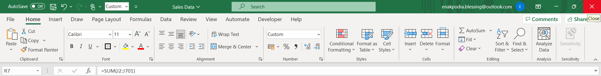
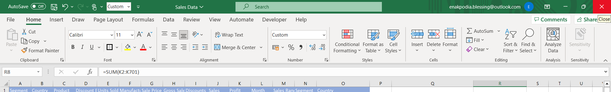
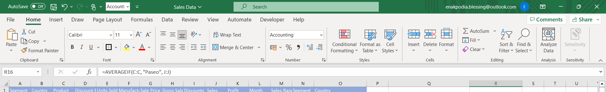
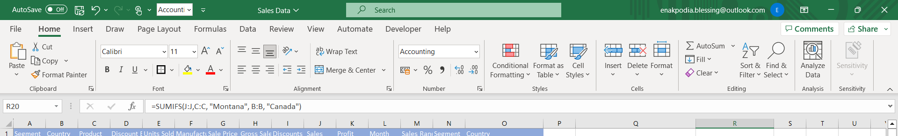
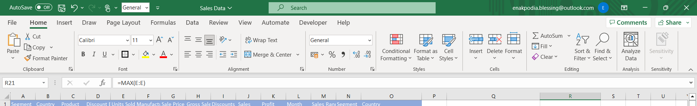
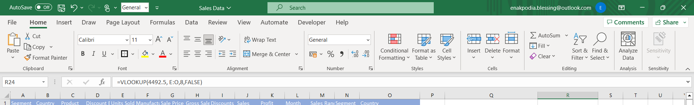
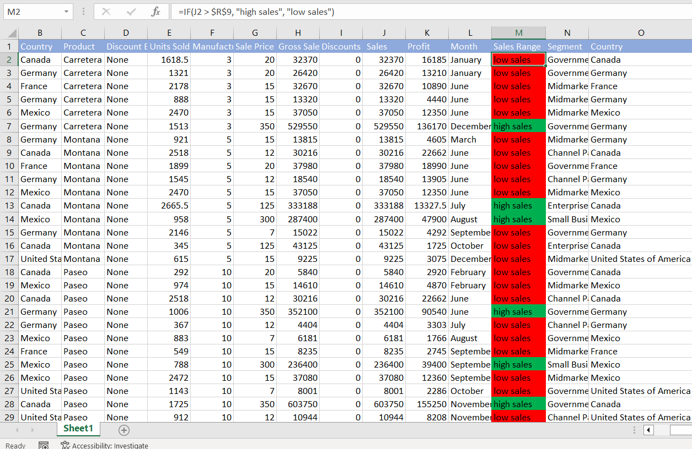

# Keezo-Superstore Sales Data Analysis with Excel

## Introduction
Keezo superstore is a fictitious retail store.

## Problem statement
Keezo superstores aims to gain valuable insights into its sales and financial performance to make informed business decisions. The store requires an in-depth analysis of various key metrics to evaluate its revenue, profit, and sales across different segments and regions. To achieve this, the store seeks answers to the following questions:

1. What is the total revenue generated by the store?
2. What is the total profit earned by the store?
3. What is the average revenue per transaction?
4. What is the average number of units sold per transaction?
5. What is the total discount given by the store?
6. How many sales transactions were conducted in the specified period?
7. What was the highest profit obtained from a single transaction?
8. What is the average revenue for transactions made in the "Paseo" segment?
9. How many sales transactions were made to customers in the "Government" segment?
10. How many sales transactions were made to customers in the "Midmarket" segment?
11. How many sales transactions were made to customers in both the "Government" and "Midmarket" segments?
12. What was the total revenue generated in the "Montana" region of Canada?
13. What was the highest number of units sold in a single transaction?
14. Which country had the highest number of units sold overall?
15. Which segment had the highest number of units sold overall?
16. In which month were the highest number of units sold?
17. What was the total profit earned in the month of December?
18. Create a new column titled "Sales range" and tag sales above average sales 'high sales' otherwise, 'low sales'.

Keezo Superstore expects comprehensive answers to these questions to gain a comprehensive understanding of its sales performance, profitability, and customer segments, enabling data-driven decision-making and improved business outcomes.

## Skills Demonstrated:

To effectively address the business question and derive meaningful insights, proficiency in the following excel functions and tools were demonstrated throughout the analysis; _SUM, SUMIF, SUMIFS, AVERAGE, AVERAGEIF, AVERAGEIFS, COUNT, COUNTA, COUNTIF, COUNTIFS, IF, IFS, MAX, MIN, and VLOOKUP_.

Furthermore, clearer insights were attained by incorporating techniques such as **conditional formatting, data validation, cell referencing, filtering, and sorting**. These methods were instrumental in enhancing the organization of the data, making it easier to identify patterns and significant findings throughout the analysis.

## Dataset
The dataset consists of;
-  1 sheet
-  15 columns
- 700 rows

## Analysis
1. What is the total revenue generated by the store?
   To determine the total revenue generated by Keezo superstore, I used the SUM function in adding up the values on the sales column as shown below;
   
   
   Total revenue generated = **$118,726,350**
   
2. What is the total profit earned by the store?
   The SUM function was used in adding the values of the profit column.

   
   Total profit generated = **$16,893,702**

3. What is the average revenue per transaction? The AVERAGE function was used on the sales column to determine the average revenue.

    .
   Average revenue =  **$169,609.07** 

4. What is the average number of units sold per transaction? The AVERAGE function was used on the Units sold column to determine this.
   
    
   Average no. of units sold = **1608**
   
5. What is the total discount given by the store? The SUM function was used on the discounts column to determine this.
    
   Total discount = **$9,205,248.24**
   
6. How many sales transactions were conducted in the specified period? The COUNT function was used to count the number of sales transaction that was conducted. The function was used on the sales column.
    
   Total No. of Sales = **700**
   
7. What was the highest profit obtained from a single transaction? The MAX function was used on the profit column to determine this.
    
    Highest Profit/transaction = **$262,200**

8. What is the average revenue for transactions made in the "Paseo" segment? The AVERAGEIF function was used on the sales and segment column.

    
   Average revenue (Paseo) = **$163,421.50**
   
9. How many sales transactions were made to customers in the "Government" segment? The COUNTIF function was used on the sales and segment column to determine this.
     
   Total no. of Sales (Government) = **300**
   
10. How many sales transactions were made to customers in the "Midmarket" segment? The COUNTIF function was used on the sales and segment column to determine this.
     
    Total no. of sales (Midmarket) = **100**
    
11. How many sales transactions were made to customers in both the "Government" and "Midmarket" segments? The total number of sales made under the Government and Midmarket segments were added together to determine this.
    
      
    Total no. of sales (Government & Midmarket) = **400**
    
12. What was the total revenue generated in the "Montana" region of Canada? The SUMIFS function was used on the product and region column.

     
    Total revenue (Montana) Canada = **$2,711,919.03**
    
13. What was the highest number of units sold in a single transaction? The MAX function was used to determine this.

     
    Highest no. units sold/transaction = **4492.5**
    
14. Which country had the highest number of units sold overall? The VLOOKUP function was used to determine this.

     
    Country with highest no. units sold = **United States of America**
     
15. Which segment had the highest number of units sold overall? The VLOOKUP function was used to determine this.

     
    Segment with highest number of units sold = **Government**
    
16. In which month were the highest number of units sold? The VLOOKUP function was used to determine this.

    
    Month with highest number of units sold = **April**
    
17. What was the total profit earned in the month of December? The SUMIF function was used to determine this.

    
    Total profit in December = **$2,717,329.98**

18. Create a new column titled "Sales range" and tag sales above average sales 'high sales' otherwise, 'low sales'. The IF function was used to meet this condition and the conditional formatting tool was used to color code low sales red and high sales green to gain clearer insights. Also, cell referencing was adopted here.

    
    **Sales range** 
   

